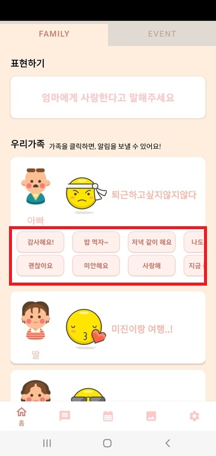
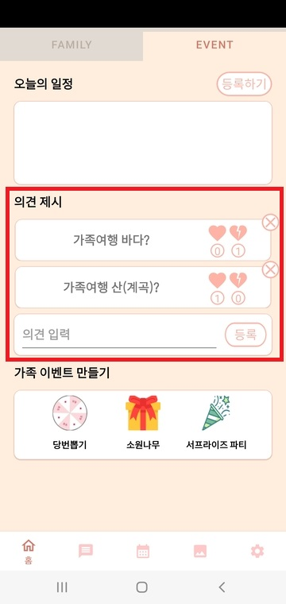
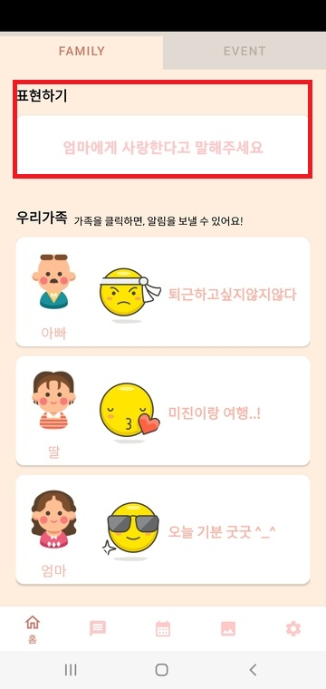

 

# :houses: 도담도담

가족간의 부드러운 소통을 유도하는 FNS(Family Network Service)

 

## 👨‍👩‍👦팀원 소개

|순번|이름|담당 역할|깃허브|
|:--:|:---:|:---:|:---:|
|1|**전창기(Chang Gi Jeon)**|팀장, 백엔드, 서버|[@ChanggiJeon](https://github.com/ChanggiJeon)|
|2|**이석규(SEOK GYU LEE)**|부팀장, 안드로이드|[@likppi10](https://github.com/likppi10)|
|3|**윤재성(Yoon Jae Sung)**|백엔드|[@Jaeseed](https://github.com/Jaeseed)|
|4|**김종현(Jong Hyeon Kim)**|안드로이드, 발표|[@Jhon-Kim93](https://github.com/Jhon-Kim93)|
|5|**박명우(Myoung woo Park)**|백엔드|[@myeongki](https://github.com/myeongki)|
|6|**이수형(Suh Yeong Lee)**|안드로이드|[@eel0511](https://github.com/eel0511)|
 

 

## :film_projector: 프로젝트 개요

</img>
</img>
</img>
</img> 
</img>
</img>

- **진행 기간**: 2022.04.11 ~ 2022.05.20
- **목표**
  - 가족 간의 소통을 부드럽게 유도하는 '**넛지**'스러움을 추구합니다.
  - 채팅, 앨범, 일정 공유, 의견 제시, 룰렛, 소원나무 기능 등 가족끼리 사용할 수 있는 '**다양한 기능**'을 제공합니다.
  - 가족 간에 소통이 어렵거나 어색한 이용자를 위하여 이모티콘 리액션, 프로필 기본 이미지 제공, 자주 사용하는 푸시 알람 제공 등 가족 간 '**소통의 장벽**'을 낮췄습니다.
- **:interrobang: 용어 정리**
  - **넛지(Nudge)**
    - '타인의 선택을 유도하는 부드러운 개입'을 뜻합니다.
    - 대표적인 예시로는 소변기에 붙어있는 파리 스티커 등이 있습니다.
  - **도담도담**
    - (어린아이가) 잘 자라나는 모습을 의미하는 순 우리말
- **✏기획서**
  - <a href="Documentation/프로젝트_기획안_구미2반_D203.docx">기획안</a>
- **🖼와이어프레임**
  - <a href="https://www.figma.com/file/fbewMD0TU3fMgGss8TGRrN/Untitled?node-id=0%3A1">와이어프레임 확인하기</a>
- **🎬UCC**
  - <a href="https://www.youtube.com/watch?v=2hZqbMBpxUw">도담도담UCC</a>
   

## ✨ 프로젝트 소개
**도담도담**은 가족간의 부드러운 소통을 유도하는 FNS(Family Network Service)입니다.

- 패밀리 네트워크 서비스 "**도담도담**"은 일반적인 사회 관계와는 다른 "**가족**"이라는 특별한 관계에 초점을 두고 만들어진 관계망 서비스입니다.

- 도담도담은 "**넛지(Nudge)**"라는 전략을 채택하여 이용자가 부담스럽지 않은, 하지만 가족 유대에 긍정적인 효과를 기대할 수 있는 다양한 기능들을 제공합니다.

- 혹시 매일같이 가족과 연락하시는 분이 계신가요? 바쁘고 힘든 일상에 치여서 소중한 가족과의 소통이 소원해졌다면, 저희 "**도담도담**"을 사용해보세요!
- 도담도담은 "**다양한 기능**"을 제공합니다!

 

## ⭐️주요 기능

### 소통 기능

> 도담도담은 다양한 기능을 제공하여 '**넛지스럽게**' 가족간의 소통을 유도합니다.

- 알림 기능 
  - 일일이 채팅으로 안부를 물으셨나요? 오늘의 인사를 클릭한 번으로 해보세요!

- 오늘의 기분, 상태

  - 매일매일 가족들의 기분, 상태를 한눈에 볼 수 있습니다!

- 의견 제시 기능

  - 여름에 가는 가족 여행으로 계곡이 좋을지 바다가 좋을지 고민이신가요? 의견을 등록하고 가족들의 리액션을 받아서 결정해 보시는 것은 어떨까요?

- 데일리 미션

  - 가족과의 소통이 어려우신가요? 어떤 말을 걸지 망설여지시나요? 매일 초기화되는 오늘의 미션을 수행하며, 가족과 소통을 해보세요!

- 일정 기능

  - 내 일정을 등록하고 가족과 공유해 보세요!

- 채팅 기능

  - 알람 기능이 있다고 해도 채팅은 필요하죠? 걱정 마세요! 도담도담은 채팅 기능도 갖추고 있습니다!
  
 

- Sample UI

|알람 기능|오늘의 기분,상태|의견 제시|
|:---:|:---:|:---:|
||||

|데일리 미션|일정기능|채팅 기능|
|:---:|:---:|:---:|
||||

### 부가 기능

> 가족들의 추억 저장소 앨범기능부터~ 오늘의 당번을 뽑는 룰렛기능까지!

- 소원 나무 기능
  - 평소에 가족이 무엇을 원하는지 궁금하지 않으신가요? 혹시 내 생일날 받고 싶은 선물을 가족에게 살짝 쿵 알리고 싶지는 않으신가요? 가족만을 위한 트리가 도와드립니다!

- 룰렛 기능

  - 오늘의 당번을 뽑아보자! 

- 앨범 기능

  - 가족과의 추억 저장소! 이모티콘으로 리액션을 편하게 등록해 보세요!

 

- Sample UI

|소원나무|당번뽑기|앨범 기능|
|:---:|:---:|:---:|
||||

  

 

## 📐 서비스 아키텍쳐

 

 

## ⚙​ 개발 환경 및 IDE

- ### DevOps

  - AWS EC2 Server(AWS amazon-linux-2)
  - Jenkins Server(Ubuntu: 20.04.4 LTS)

- ### Android

  - Kakao Login (v2) API : 2.9.1 
  - Firebase (푸시알림) : 21.1.1
  - Hilt (의존성 주입) : 2.41 
  - Android JetPack Calendar : 1.0.4 
  - Retrofit : 2.9.0 
  - Roulette : 1.0.0

- ### BE

  - Spring Boot: 2.6.6
  - openJdk 11
  - gradle 7.1

- ### DB

  - mariaDB: 10.3.34

- ### IDE

  - IntelliJ Ultimate 21.3.1
  - Android Studio

 

## 🎞 최종산출물

<a href="https://www.youtube.com/watch?v=2hZqbMBpxUw">도담도담 UCC 영상</a>

 
<a href="Documentation/D203_최종발표.pdf">도담도담 최종발표 pdf</a>

